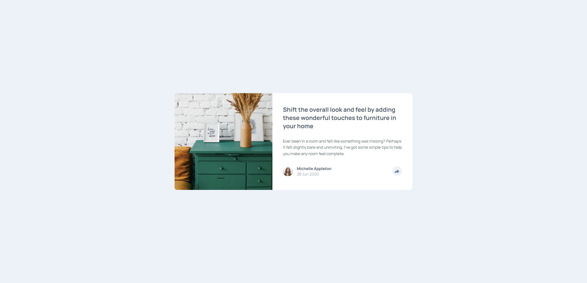

# Frontend Mentor - Article preview component solution

This is a solution to the [Article preview component challenge on Frontend Mentor](https://www.frontendmentor.io/challenges/article-preview-component-dYBN_pYFT). Frontend Mentor challenges help you improve your coding skills by building realistic projects.

## Table of contents

- [Overview](#overview)
  - [The challenge](#the-challenge)
  - [Screenshot](#screenshot)
  - [Links](#links)
- [My process](#my-process)
  - [Built with](#built-with)
  - [What I learned](#what-i-learned)
- [Author](#author)

## Overview

### The challenge

Users should be able to:

- View the optimal layout for the component depending on their device's screen size
- See the social media share links when they click the share icon

### Screenshot

### Links

- Solution URL: [Add solution URL here](https://github.com/Antonvasilache/article-preview-component)
- Live Site URL: [Add live site URL here](https://article-preview-component-av.netlify.app/)

## My process

1. Creating the desktop layout and formatting the content.
2. Sizing the image to match the design layout.
3. Rearranging the grid layout for mobile screens.
4. Resizing the image for smallers screens.
5. Adding the tooltip for social media sharing.
6. Adding the Javascript functionality for the share icon.

### Built with

- Semantic HTML5 markup
- CSS custom properties
- Flexbox
- CSS Grid
- JavaScript

### What I learned

- Creating and positioning tooltips.
- Working with CSS properties based on selector specificity.

## Author

- Website - [Antonvasilache.com](https://www.antonvasilache.com)
- Frontend Mentor - [@Antonvasilache](https://www.frontendmentor.io/profile/Antonvasilache)
